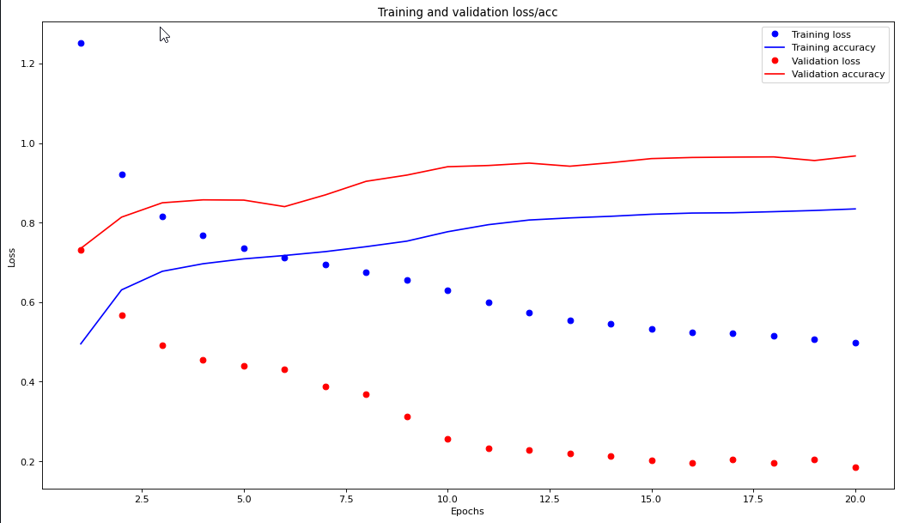

# Digital personal trainer and workout tracker

This project is a fitness tracking application that monitors your body movements throughout a workout session. It helps to maintain correct posture, keeps track of your repetitions, and ensures that you exercise with proper form to achieve optimal results.

## Overview

This project utilizes deep learning techniques to analyze body movements captured by sensors or cameras during workouts. By analyzing these movements, it provides real-time feedback to users, guiding them to perform exercises with correct form and technique. It also tracks the number of repetitions performed for each exercise, allowing users to monitor their progress over time.

## Key Features

- **Posture Correction**: It identifies and corrects improper posture during exercises, helping users avoid injury and maximize effectiveness.
- **Repetition Tracking**: It counts repetitions for each exercise, providing users with accurate feedback on their workout performance.
- **Real-time Feedback**: It provides real-time feedback on form and technique, guiding users to perform exercises correctly.
- **Progress Tracking**: It tracks users' progress over time, allowing them to monitor improvements and set new fitness goals.

## Usage

To use this project:

1. Clone the repository to your local machine:

    ```bash
    git clone https://github.com/krishshah249/Workout-Wizard.git
    ```

2. Navigate to the cloned repository:

    ```bash
    cd Workout-Wizard
    ```

3. Install the necessary dependencies:

    ```bash
    pip install -r requirements.txt
    ```

4. Run the provided Jupyter notebook or Python scripts "deepfit_integration" to train and deploy the model.

## Methodology

#### 1. Keypoint Detection 
The pre-trained MediaPipe landmark model in use is a Convolutional Neural Network and is trained with an input layer of size `[1,256,256,3]`, which is accepted as incoming video feed from the webcam (256 x 256 pixels’ RGB values). The result received from the output layer is of shape `[33, 5]`. It translates to the 33 keypoints being detected by the model. The 5 additional parameters in the output map to the X, Y, and Z coordinates in the image (or video frame) and two factors for visibility and presence. 
	
#### 2. Pose Classification  
18 of the 33 detected keypoints are used to train a pose classifier. The model tells us what workout is being performed, which leads us to task 3. 

#### 3. Pose Correction
Once the workout has been identified by our Classifier model, we use these keypoints to calculate the angles between limbs and compare it against benchmarks to identify if the person has an appropritate posture for an exercise. Apart from posture correction, these keypoints are also used to count the number of reps correctly performed for the workout. 
	
The following image shows the keypoints provided by the Pose Landmark Model from MediaPipe:


## Dataset

The dataset originally contains around 1.1 million frames worth of data (~800 minutes of video), which was filtered out for training the model. We only retained the labeled frames and removed all the noise for our prototype. This left us with a total of 375,753 frames. This dataset to train a neural network to identify what exercise the person is performing. The MMFit dataset is a collection of inertial sensor data from smartphones, smartwatches and earbuds worn by participants while performing full-body workouts, and time-synchronised multi-viewpoint RGB-D video, with 2D and 3D pose estimates. The dataset can be downloaded from [here](https://mmfit.github.io/).

## Model Architecture

#### The input shape is of (36,). These denote the X and Y coordinates of the below 18 keypoints:  
```
 0: 'Nose', 
 1: 'Neck', 
 2: 'Right Shoulder', 
 3: 'Right Elbow', 
 4: 'Right Wrist',
 5: 'Left Shoulder',
 6: 'Left Elbow',
 7: 'Left Wrist',
 8: 'Right Hip',
 9: 'Right Knee',
 10: 'Right Ankle',
 11: 'Left Hip', 
 12: 'Left Knee',
 13: 'Left Ankle',
 14: 'Right Eye',
 15: 'Left Eye',
 16: 'Right Ear'
```
#### The output provides the probability of the input falling under one of the 10 classes:  
```
 'squats': 0,
 'lunges': 1,
 'bicep_curls': 2,
 'situps': 3,
 'pushups': 4,
 'tricep_extensions': 5,
 'dumbbell_rows': 6,
 'jumping_jacks': 7,
 'dumbbell_shoulder_press': 8,
 'lateral_shoulder_raises': 9
```

#### A sequential model with 2 hidden layes and a dropout of 0.5 is used to prevent overfitting. Below is a Keras model summary: 
``` 
_________________________________________________________________
Layer (type)                 Output Shape              Param #   
=================================================================
dense_16 (Dense)             (None, 64)                2368      
_________________________________________________________________
dropout_12 (Dropout)         (None, 64)                0         
_________________________________________________________________
dense_17 (Dense)             (None, 32)                2080      
_________________________________________________________________
dropout_13 (Dropout)         (None, 32)                0         
_________________________________________________________________
dense_18 (Dense)             (None, 16)                528       
_________________________________________________________________
dropout_14 (Dropout)         (None, 16)                0         
_________________________________________________________________
dense_19 (Dense)             (None, 10)                170       
=================================================================
Total params: 5,146
Trainable params: 5,146
Non-trainable params: 0
_________________________________________________________________
```

#### The loss function used is sparse_categorical_crossentropy. A learning rate of 0.01 is used and is trained over 20 epochs and achieved validation accuracy of 96%.


## Evaluation

#### A Validation Loss of 0.1938 is achieved and an accuracy of 0.9588 which can be seen from the graph shown below



#### The pose is recognized, normalized and classified can be understood from the diagram below


## Contributing

Contributions to Workout Wizard are welcome! If you have ideas for improvements, new features, or bug fixes, feel free to open an issue or submit a pull request.
